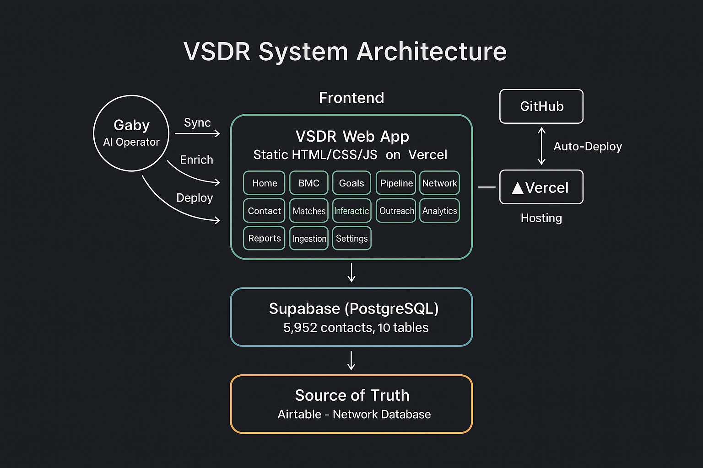
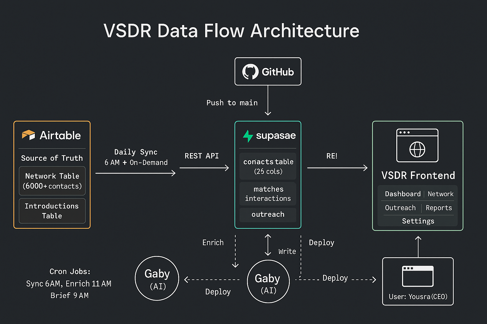
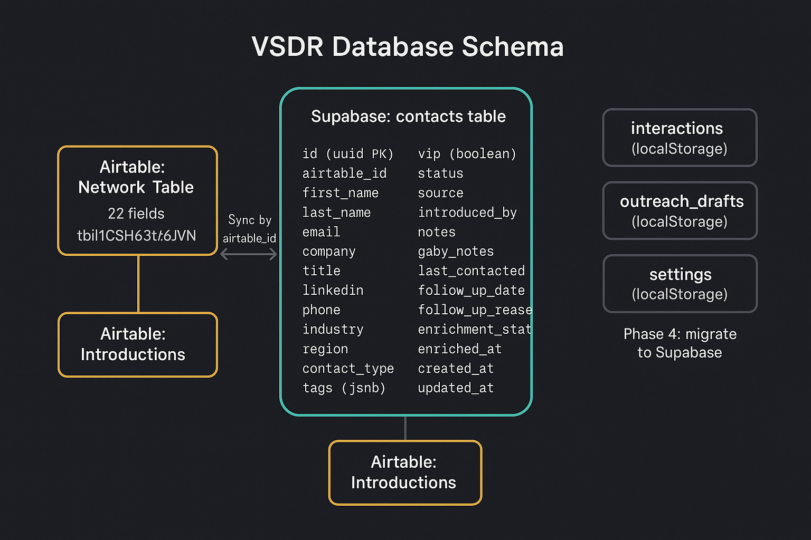
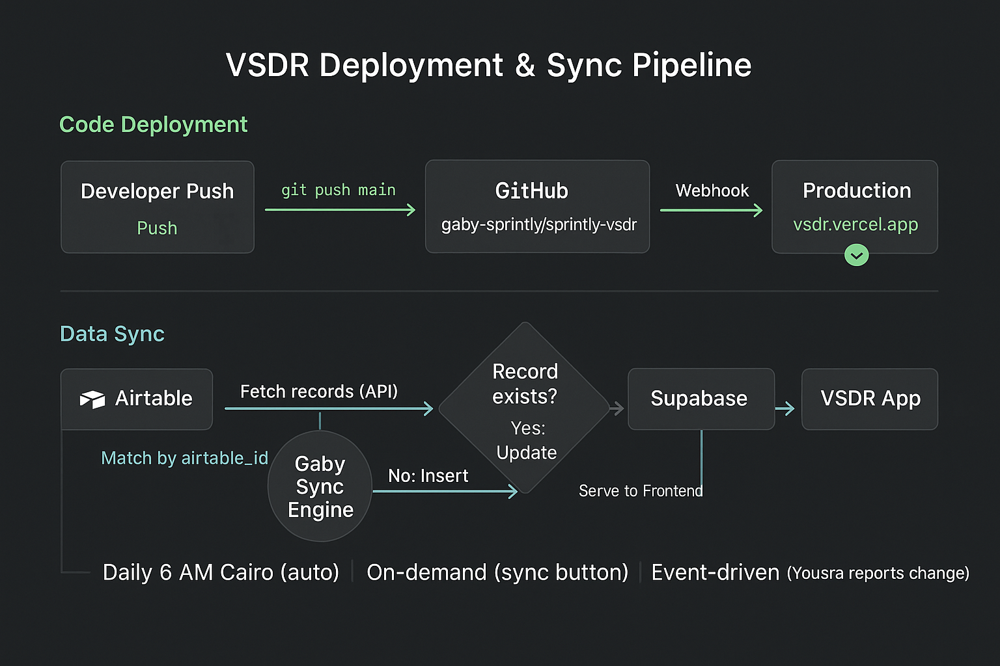

# VSDR - Virtual Strategy Data Room
## Product Requirements Document (PRD)

**Version:** 2.0
**Date:** March 30, 2026
**Author:** Gaby, Strategic Operator, Sprintly Partners
**Owner:** Yousra (Youyou), Founder & CEO, Sprintly Partners
**Status:** Feature-Complete (v2.0)
**Live URL:** https://vsdr.vercel.app
**Repository:** github.com/gaby-sprintly/sprintly-vsdr

---

## 1. Executive Summary

The Virtual Strategy Data Room (VSDR) is a proprietary, always-on strategic command center built for Sprintly Partners. It consolidates strategy, goals, pipeline, network intelligence, outreach, and analytics into a single, real-time web application.

The VSDR replaces fragmented tools (spreadsheets, CRM dashboards, slide decks) with a unified dark-mode interface that provides the CEO with instant visibility into every dimension of the business, from high-level strategy to individual contact profiles.

**Key metrics:**
- 5,952 contacts synced from Airtable
- 13 pages across 9 functional modules
- Live Supabase backend with bi-directional Airtable sync
- Auto-deployed via Vercel from GitHub

---

## 2. Problem Statement

### Current Pain Points
1. **Fragmented data:** Strategy lives in decks, contacts in Airtable, goals in Notion, pipeline in spreadsheets. No single source of truth.
2. **Manual updates:** Keeping strategy documents current requires manual effort across multiple platforms.
3. **No real-time visibility:** The CEO cannot see network health, pipeline status, or goal progress at a glance.
4. **Outreach inefficiency:** No centralized system for drafting, queuing, and tracking outreach across 6,000+ contacts.
5. **Data decay:** Contact information goes stale without automated enrichment and follow-up tracking.

### Solution
A purpose-built web application that:
- Aggregates all strategic data in one interface
- Syncs bidirectionally with Airtable (source of truth for contacts)
- Provides real-time dashboards, search, filtering, and analytics
- Enables outreach management and interaction tracking
- Supports data ingestion from multiple sources

---

## 3. Target Users

| User | Role | Access Level |
|------|------|-------------|
| Yousra (CEO) | Primary user, decision-maker | Full read/write |
| Gaby (AI Operator) | Maintains data, runs syncs, enriches contacts | Full backend access |
| External stakeholders | May receive shared links to specific views | Read-only (future) |

---

## 4. Product Architecture

### 4.1 Technology Stack

| Layer | Technology | Purpose |
|-------|-----------|---------|
| Frontend | Static HTML/CSS/JS | Zero-dependency, fast, portable |
| Styling | Inline CSS, CSS Custom Properties | Dark-mode design system |
| Charts | Chart.js 4.4.1 (CDN) | Analytics visualizations |
| CSV Parsing | Papa Parse 5.4.1 (CDN) | Data ingestion |
| Database | Supabase (PostgreSQL) | Live data store |
| Source of Truth | Airtable | Contact management |
| Hosting | Vercel | Auto-deploy from GitHub |
| Version Control | GitHub | gaby-sprintly/sprintly-vsdr |
| Sync Engine | Gaby (AI-operated) | Airtable to Supabase bidirectional |

### 4.2 System Architecture Diagram



The system follows a three-tier architecture: static frontend on Vercel, Supabase PostgreSQL backend, and Airtable as the source of truth. Gaby (AI Operator) orchestrates sync, enrichment, and deployments across all layers.

### 4.3 Data Flow



Data flows from Airtable (source of truth) through Gaby's sync engine into Supabase, which serves the VSDR frontend via REST API. GitHub pushes trigger auto-deployment through Vercel. Cron jobs handle scheduled syncs, enrichment, and briefings.

### 4.4 Database Schema



The primary `contacts` table (26 columns) in Supabase maps to Airtable's Network table. Interactions, outreach drafts, and settings currently use localStorage (Phase 4: migrate to Supabase).

### 4.5 Deployment & Sync Pipeline



Two parallel pipelines: Code Deployment (GitHub → Vercel → Production) and Data Sync (Airtable → Gaby → Supabase → Frontend). Sync triggers: daily 6 AM Cairo, on-demand via sync button, event-driven.

---

## 5. Design System

### 5.1 Visual Identity

| Property | Value |
|----------|-------|
| Theme | Dark mode (charcoal base) |
| Primary font (display) | Space Grotesk (700, 600, 500) |
| Secondary font (body) | General Sans (400, 500, 600) |
| BMC page font (display) | Clash Display |
| BMC page font (body) | Satoshi |
| Border radius | 2px (sharp, minimal) |
| Card elevation | 1px border, no shadows |
| Transitions | 0.15s ease (interactions), 0.25s ease (navigation) |

### 5.2 Color Palette

| Token | Hex | Usage |
|-------|-----|-------|
| --green | #4ECB71 | Primary accent, active states, success |
| --charcoal | #0F1923 | Page background |
| --teal | #2DD4BF | Secondary accent, sync buttons, enrichment |
| --amber | #F59E0B | Warnings, upcoming follow-ups |
| --coral | #EF4444 | Errors, overdue items |
| --gold | #FBBF24 | VIP indicators |
| --n50 | #F8FAFC | Primary text |
| --n400 | #94A3B8 | Secondary text, labels |
| --n800 | #1E293B | Card backgrounds |
| --border | rgba(255,255,255,0.06) | Subtle borders |
| --surface | rgba(255,255,255,0.03) | Hover surfaces |

### 5.3 Component Patterns

**Cards:**
- Background: var(--n800)
- Border: 1px solid rgba(255,255,255,0.06)
- Hover: translateY(-2px) + accent border color
- Padding: 24-32px

**Buttons:**
- Primary: green background, charcoal text
- Secondary: transparent background, border, n400 text
- Sync: teal border and text, transparent background
- Pill filters: small, rounded, border-based

**Modals:**
- Backdrop: rgba(0,0,0,0.6) with blur(8px)
- Card: rgba(30,41,59,0.95) with blur(20px)
- Max-width: 440-600px

**Stats Bars:**
- Horizontal row of stat blocks
- Each block: number (display font, 28px) + label (11px uppercase)
- Shimmer loading animation

**Navigation:**
- 240px fixed sidebar
- Active state: green left border + subtle green background
- Sub-navigation: indented 44px, smaller font
- Mobile: hamburger + slide-in + backdrop

---

## 6. Module Specifications

### Module 1: Home Dashboard (index.html)

**Purpose:** Entry point and navigation hub.

**Features:**
- 6 card grid linking to all major sections
- Each card shows: icon, label, stat number, sublabel, secondary info
- Live pulse dot indicating system health
- Dynamic stats pulled from Supabase

**Cards:**
| Card | Stat | Links to |
|------|------|----------|
| Strategy | 9 Canvas Blocks | bmc.html |
| Goals | 5 Annual Goals | goals.html |
| Pipeline | 7 Active Projects | pipeline.html |
| Network | 2 VIPs | network.html |
| Matches | 25 Active | matches.html |
| Analytics | 5,952 Contacts | analytics.html |

**Responsive:** 3-column → 2-column → 1-column

---

### Module 2: Business Model Canvas (bmc.html)

**Purpose:** Visual representation of Sprintly Partners' business model using the Business Model Canvas framework.

**Features:**
- 9-block canvas layout (Key Partners, Key Activities, Key Resources, Value Propositions, Customer Relationships, Channels, Customer Segments, Cost Structure, Revenue Streams)
- Each block is expandable with detailed content
- Distinct visual styling (Clash Display + Satoshi fonts)
- Animated entrance transitions

**Content Source:** Static (manually maintained)

---

### Module 3: Goals & OKRs (goals.html)

**Purpose:** Track annual and quarterly goals with progress indicators.

**Features:**
- 5 annual goals with expandable quarterly breakdowns
- Progress bars with percentage completion
- Status indicators: On Track (green), At Risk (amber), Behind (coral)
- Accordion-style expand/collapse

**Goals tracked:**
1. Revenue targets
2. Network growth
3. Program launches
4. Client acquisition
5. Brand positioning

**Content Source:** Static (updated manually or via Gaby)

---

### Module 4: Pipeline & Projects (pipeline.html)

**Purpose:** Track active projects and their stages.

**Features:**
- 7 active project cards
- Each card: project name, client, stage badge, description, key milestones
- Clickable cards open detailed project view (project.html)
- "Create Proposal" action button
- Stage filters: Discovery, Active, Closing, Complete

**Content Source:** Static JSON (projects-data.json)

---

### Module 5: Network (network.html)

**Purpose:** Browse, search, and manage 5,952+ contacts from the Supabase-synced Airtable database.

**Features:**
- **Live data:** All contacts fetched from Supabase REST API
- **Stats bar:** Total, VIPs, Founders, Investors, Follow-ups Due, Enrichment %
- **Search:** Real-time search by name, company, or tags
- **Filter pills:** All, Founders, Investors, Corporate, Advisors, VIPs, Needs Follow-up, Needs Enrichment
- **VIP pinned section:** Gold-starred VIP contacts always visible at top
- **Contact cards:** Name, company, title, type badge, tags, relationship heat (color-coded border), enrichment dot, follow-up badge
- **Relationship heat mapping:**
  - Hot (green): contacted within 7 days
  - Warm (yellow): within 30 days
  - Cold (orange): within 90 days
  - Dead (red): 90+ days
  - None (gray): never contacted
- **Enrich button:** Per-card enrichment trigger with confirmation modal
- **Pagination:** Load More with progressive loading (50 per page)
- **Click-through:** Each card links to contact detail page

**Data source:** Supabase `contacts` table (live)

---

### Module 6: Contact Detail (contact.html)

**Purpose:** Full profile view for individual contacts.

**Features:**
- **Profile header:** Name, company, title, VIP badge, type badge
- **Contact info:** Email, phone, LinkedIn (clickable)
- **Action buttons:** Email, Call, LinkedIn, Enrich
- **Timeline:** Interaction history (placeholder for future)
- **Notes section:** Gaby notes + manual notes
- **Metadata:** Source, introduced by, date added, last contacted
- **Tags display:** All contact tags
- **Relationship heat indicator**
- **Follow-up management:** Date, reason, overdue highlighting

**Data source:** Supabase `contacts` table, fetched by `?id=` URL parameter

---

### Module 7: Matches & Introductions (matches.html)

**Purpose:** Review and approve AI-suggested introduction matches between contacts.

**Features:**
- **25 active match cards:** Each showing two contacts to potentially introduce
- **Match scoring:** Relevance score and match reason
- **Actions per match:** Like (approve), Dislike (reject), Approve (queue for intro)
- **Status tracking:** Pending, Approved, Sent, Completed
- **Filter pills:** All, Pending, Approved, Sent

**Data source:** Static + localStorage

---

### Module 8: Interaction Tracking (interactions.html)

**Purpose:** Log and review all touchpoints with contacts.

**Features:**
- **Timeline view:** Newest interactions first, color-coded by type
- **Interaction types:** Email (teal), Call (green), Meeting (amber), Note (gold), LinkedIn (coral)
- **Each card shows:** Contact name, type icon, date/time, summary, notes
- **Stats bar:** Total Interactions, This Week, Emails, Calls, Meetings
- **Add Interaction modal:** Contact search, type dropdown, date picker, summary, notes textarea
- **Filters:** By type, date range
- **Search:** By contact name

**Data source:** localStorage (Supabase table planned)

---

### Module 9: AI Outreach Copilot (outreach.html)

**Purpose:** Draft, queue, and track outreach communications.

**Features:**
- **Outreach queue:** 2-column card grid showing all drafts/sent
- **Each card:** Recipient name, company, subject, preview, status badge
- **Status badges:** Draft (gray), Queued (amber), Sent (green), Replied (teal)
- **Filter pills:** All, Drafts, Queued, Sent, Replied
- **New Outreach modal:**
  - Recipient search (autocomplete from Supabase contacts)
  - Type selector: Intro Request, Follow-up, Cold Outreach, Partnership
  - Subject line
  - Body textarea
- **Templates section:** 3 pre-built templates
  - Introduction Request
  - Follow-up
  - Partnership Inquiry
- **Edit/Delete actions** per draft
- **Stats:** Total Drafts, Queued, Sent This Month, Reply Rate

**Data source:** localStorage (email integration planned)

---

### Module 10: Analytics Dashboard (analytics.html)

**Purpose:** Network intelligence and health metrics.

**Features:**
- **Stats bar:** Total Contacts, Enriched %, VIPs, Follow-ups Due
- **Charts (Chart.js):**
  - Contact growth over time (line chart)
  - Contacts by type (bar chart)
  - Enrichment progress (doughnut chart)
  - Follow-up compliance (bar chart)
- **Network Health Score:** Composite metric (0-100) based on enrichment %, follow-up compliance, relationship heat
- **Coverage Gap Analysis:** Shows under-represented industries, regions, types
- **Animated counters:** Numbers count up on page load

**Data source:** Supabase (live queries)

---

### Module 11: Reports & Exports (reports.html)

**Purpose:** Generate reports and export data.

**Features:**
- **Report cards:**
  - Network Health Report (live stats from Supabase)
  - Pipeline Status summary
  - Weekly Digest
  - Contact Growth (Chart.js line chart)
- **Export actions:**
  - "Export Contacts CSV" — downloads real CSV from Supabase data
  - "Export Report PDF" — coming soon placeholder
- **Toast notification system** for export feedback
- **Stats bar:** Live counts from Supabase

**Data source:** Supabase (live) + localStorage

---

### Module 12: Data Ingestion (ingestion.html)

**Purpose:** Import contacts into the system from multiple sources.

**Features:**
- **Three-tab interface:**
  1. **CSV Upload:**
     - Drag-and-drop zone
     - File picker fallback
     - Papa Parse CSV parsing
     - Preview table (first 5 rows)
     - Column mapping UI (map CSV columns to Supabase fields)
     - Batch import with progress bar
     - Insert directly to Supabase
  2. **Manual Add:**
     - Full contact form (all fields from schema)
     - Direct Supabase insert
     - Success/error feedback
  3. **Bulk Paste:**
     - Textarea for multi-line paste (name, email, company per line)
     - Auto-parse and preview
     - Batch insert
- **Import History:** Recent imports with count, date, status (localStorage)

**Data source:** User input → Supabase

---

### Module 13: Settings (settings.html)

**Purpose:** System configuration and sync management.

**Features:**
- **Sync Management (primary section):**
  - Large "Sync Airtable ↔ Supabase Now" button
  - Last sync timestamp display
  - Sync schedule: "Auto-sync daily at 6 AM Cairo"
  - Sync log: last 10 events (localStorage)
- **Data Counts:** Live from Supabase (total, enriched, VIPs, follow-ups)
- **Display Preferences:**
  - Contacts per page (25/50/100)
  - Default sort order
  - Theme toggle placeholder
- **About section:** Version, built by Gaby, GitHub link

**Data source:** Supabase (counts) + localStorage (preferences)

---

## 7. Global Features

### 7.1 Sync Button (All Pages)
Every page includes a "⟳ Sync Airtable ↔ Supabase" button in the page header area. Behavior:
1. Click opens confirmation modal
2. Modal explains what sync does
3. "Confirm" triggers success state
4. "Sync requested! Gaby will process this shortly."
5. Gaby (AI operator) receives the request and runs the actual sync

### 7.2 Sidebar Navigation
- Fixed 240px left panel on desktop
- Hamburger menu on mobile (<768px)
- Backdrop overlay on mobile when open
- Full navigation to all 13 pages
- Active state highlighting
- Sub-navigation for Network children (Matches, Interactions)
- Version indicator (v2.0)

### 7.3 Responsive Design
| Breakpoint | Behavior |
|-----------|----------|
| > 1100px | Full layout, 3-column grids |
| 768-1100px | 2-column grids |
| < 768px | Single column, hamburger nav, stacked cards |

### 7.4 Loading States
- Shimmer skeleton cards during data fetch
- Stat loading placeholders
- Error states with retry buttons
- Empty states with contextual messages

---

## 8. Database Schema

### 8.1 Supabase: contacts table

| Column | Type | Nullable | Default | Description |
|--------|------|----------|---------|-------------|
| id | uuid | No | gen_random_uuid() | Primary key |
| airtable_id | text | Yes | null | Airtable record ID for sync |
| first_name | text | Yes | null | Contact first name |
| last_name | text | Yes | null | Contact last name |
| email | text | Yes | null | Email address |
| company | text | Yes | null | Company name |
| title | text | Yes | null | Job title |
| linkedin | text | Yes | null | LinkedIn profile URL |
| phone | text | Yes | null | Phone number |
| industry | text | Yes | null | Industry classification |
| region | text | Yes | null | Geographic region |
| contact_type | text | Yes | 'other' | founder, investor, corporate, government, advisor, other |
| tags | jsonb | Yes | null | Array of tag strings |
| vip | boolean | No | false | VIP flag |
| status | text | Yes | 'active' | active, inactive, archived |
| source | text | Yes | null | How contact was acquired |
| introduced_by | text | Yes | null | Who made the introduction |
| notes | text | Yes | null | User notes |
| gaby_notes | text | Yes | null | AI operator notes |
| last_contacted | date | Yes | null | Last interaction date |
| follow_up_date | date | Yes | null | Next follow-up date |
| follow_up_reason | text | Yes | null | Why follow-up is needed |
| enrichment_status | text | Yes | 'pending' | pending, enriched, failed |
| enriched_at | timestamptz | Yes | null | When enrichment completed |
| created_at | timestamptz | No | now() | Record creation time |
| updated_at | timestamptz | No | now() | Last update time |

### 8.2 Airtable: Network Table (tblllCSH6H33t6JVN)

| Field | Type | Maps to Supabase |
|-------|------|-----------------|
| First Name | Single line text | first_name |
| Last Name | Single line text | last_name |
| Email | Email | email |
| Company | Single line text | company |
| Title | Single line text | title |
| Linkedin | URL | linkedin |
| Date Added | Date | created_at |
| VIP | Checkbox | vip |
| Follow-Up Date | Date | follow_up_date |
| Contact Type | Single select | contact_type |
| Status | Single select | status |
| Priority | Single select | (not synced) |
| Industry | Single select | industry |
| Region | Single select | region |
| Source | Single line text | source |
| Last Contacted | Date | last_contacted |
| Follow-up reason | Long text | follow_up_reason |
| Notes | Long text | notes |
| Tags | Multiple select | tags |
| Gaby Notes | Long text | gaby_notes |
| Introduced By | Single line text | introduced_by |
| Introduce To | Linked record | (not synced) |
| Introductions & Follow-Ups | Linked record | (separate table) |

### 8.3 Airtable: Introductions & Follow-Ups (tblmAKVj7gDCDFyuD)

Related table for tracking introduction requests and follow-up actions. Linked to Network via record relationships.

---

## 9. Sync Architecture

### 9.1 Sync Direction
**Airtable → Supabase** (primary): Airtable is the source of truth for contact data. All manual edits by Yousra happen in Airtable.

**Supabase → Airtable** (secondary): New contacts added via VSDR ingestion are pushed back to Airtable.

### 9.2 Sync Schedule
| Trigger | Frequency | Method |
|---------|-----------|--------|
| Automated | Daily at 6:00 AM Cairo (UTC+2) | Cron job via Gaby |
| Manual | On-demand via sync button | User-triggered, Gaby executes |
| Event-driven | When Yousra reports changes | Gaby runs immediate sync |

### 9.3 Sync Process
1. Fetch all records from Airtable Network table
2. For each record, match by `airtable_id` in Supabase
3. If match found: update changed fields, set `updated_at`
4. If no match: insert new record with `airtable_id`
5. Log sync event (count, duration, errors)

### 9.4 Conflict Resolution
- Airtable wins for fields managed in Airtable (contact info, VIP status, follow-ups)
- Supabase wins for fields managed in VSDR (gaby_notes, enrichment_status)
- Last-write-wins for shared fields with timestamp comparison

---

## 10. Deployment & Infrastructure

### 10.1 Hosting
| Component | Service | URL |
|-----------|---------|-----|
| Frontend | Vercel | https://vsdr.vercel.app |
| Database | Supabase | gxunrnyehltpbgdodkkm.supabase.co |
| Source Code | GitHub | gaby-sprintly/sprintly-vsdr |

### 10.2 Deployment Pipeline
```
Developer pushes to main branch
        │
        ▼
GitHub webhook triggers Vercel
        │
        ▼
Vercel builds (static, <1s)
        │
        ▼
Deployed to production
        │
        ▼
Available at vsdr.vercel.app
```

### 10.3 Environment
- No build step required (static HTML)
- No server-side rendering
- No environment variables in frontend (API keys are publishable)
- All API calls use Supabase publishable key (row-level security in place)

---

## 11. Performance

| Metric | Target | Actual |
|--------|--------|--------|
| First Contentful Paint | < 1s | ~0.5s |
| Page weight (average) | < 100KB | 30-50KB per page |
| API response (Supabase) | < 200ms | ~100ms |
| Total dependencies | 0 npm packages | 0 (CDN only for Chart.js, Papa Parse) |
| Build time | < 1s | Instant (static) |

---

## 12. Security

| Concern | Mitigation |
|---------|-----------|
| API key exposure | Publishable key only (read-level), RLS enforced |
| Data modification | Write operations require service key (server-side only) |
| Authentication | No user auth required (private URL, Vercel access) |
| CORS | Supabase CORS configured for vsdr.vercel.app |
| Input sanitization | All user input escaped via textContent/innerHTML patterns |

**Future considerations:**
- Vercel password protection for the deployment
- Supabase Row Level Security policies
- Auth integration (Supabase Auth or Vercel Auth)

---

## 13. Cron Jobs & Automation

| Job | Schedule | Description |
|-----|----------|-------------|
| Airtable Sync | Daily 6:00 AM Cairo | Sync contacts from Airtable to Supabase |
| Contact Enrichment | Daily 11:00 AM Cairo | Enrich pending contacts via web search |
| VSDR Auto-Update | Every 3 days, 10:00 AM Cairo | Update goals, pipeline, network data, redeploy |
| Morning Brief | Daily 9:00 AM Cairo | Include VSDR stats in CEO briefing |
| CEO Strategy Brief | Daily 7:00 AM Cairo | High-level strategy summary |

---

## 14. Roadmap

### Phase 1: Foundation (Complete)
- [x] Home dashboard
- [x] Business Model Canvas
- [x] Goals & OKRs
- [x] Pipeline & Projects
- [x] Network page with live Supabase data
- [x] Contact detail pages

### Phase 2: Intelligence (Complete)
- [x] Matches & Introductions
- [x] Network Analytics with Chart.js
- [x] Interaction Tracking
- [x] AI Outreach Copilot

### Phase 3: Operations (Complete)
- [x] Reports & Exports (CSV download)
- [x] Data Ingestion (CSV, manual, bulk)
- [x] Settings & Sync Management
- [x] Sync button on all pages

### Phase 4: Enhancement (Planned)
- [ ] Supabase table for interactions (replace localStorage)
- [ ] Supabase table for outreach drafts (replace localStorage)
- [ ] Email integration: send outreach directly from VSDR
- [ ] PDF export for reports
- [ ] Real-time Supabase subscriptions (live updates without refresh)
- [ ] Auth: password protection or Supabase Auth
- [ ] Shared/public views for stakeholders
- [ ] Mobile PWA (installable, offline support)
- [ ] Notification system (in-app alerts for overdue follow-ups)
- [ ] AI-powered match suggestions (automated, not manual)
- [ ] Integration with Gaby email for auto-logging interactions
- [ ] Airtable webhook for real-time sync (replace polling)

---

## 15. File Structure

```
sprintly-vsdr/
├── index.html          # Home Dashboard
├── bmc.html            # Business Model Canvas
├── goals.html          # Goals & OKRs
├── pipeline.html       # Pipeline & Projects
├── project.html        # Project Detail
├── network.html        # Network Browser
├── contact.html        # Contact Detail
├── matches.html        # Matches & Introductions
├── interactions.html   # Interaction Tracking
├── outreach.html       # AI Outreach Copilot
├── analytics.html      # Network Analytics
├── reports.html        # Reports & Exports
├── ingestion.html      # Data Ingestion
├── settings.html       # Settings
├── favicon.svg         # VSDR favicon
├── network-data.json   # (legacy) Static network data
├── projects-data.json  # Static project data
├── BUILD-PLAN.md       # Build plan document
└── PRD-VSDR.md         # This document
```

---

## 16. Glossary

| Term | Definition |
|------|-----------|
| VSDR | Virtual Strategy Data Room |
| BMC | Business Model Canvas |
| VIP | Very Important Person (flagged contacts) |
| Enrichment | Process of adding missing data (industry, region, email) to contact records |
| Relationship Heat | Color-coded indicator of how recently a contact was engaged |
| Sync | Bidirectional data transfer between Airtable and Supabase |
| Outreach | Proactive communication to contacts (emails, intros, follow-ups) |
| Ingestion | Process of importing new contacts into the system |
| Match | AI-suggested introduction between two contacts |

---

## 17. Appendix

### A. Supabase Connection Details
- Project URL: https://gxunrnyehltpbgdodkkm.supabase.co
- API endpoint: /rest/v1/contacts
- Auth: apikey header with publishable key

### B. Airtable Connection Details
- Base: Sprintly Partners Network
- Primary table: Network (tblllCSH6H33t6JVN)
- Secondary table: Introductions & Follow-Ups (tblmAKVj7gDCDFyuD)

### C. Vercel Deployment
- Project: vsdr (prj_FTPOdw4nPPPHTE5w3toFvhx2RS7t)
- Production URL: https://vsdr.vercel.app
- Auto-deploy: enabled from GitHub main branch

---

*Document maintained by Gaby, Strategic Operator, Sprintly Partners.*
*Last updated: March 30, 2026*
